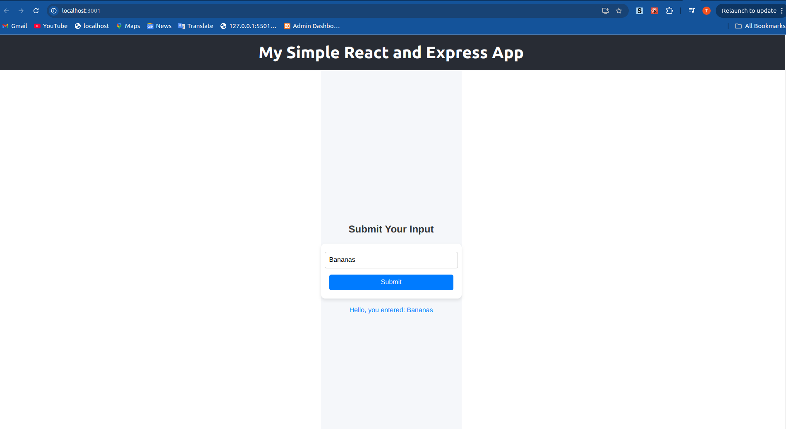

## React Express Demo Application

**Clone project**:
```bash
git clone https://github.com/bansikah22/react-express.git
```

**Start Application**:
```bash
cd backend
npm install
npm start

cd frontend
npm install
npm start
```
Make sure to change the urls inside the .env files for both frontend and backend to something like http://localhost:portnumber if you want to test locally instead

You should see this when you access the application from the frontend port


### Terraform deployment on minikube cluster
- **`Prerequisites`**
1. [Helm](https://helm.sh/docs/)
2. [Minikube](https://minikube.sigs.k8s.io/docs/start/?arch=%2Flinux%2Fx86-64%2Fstable%2Fbinary+download) or you can use Kind, or Civo any one of your choice
3. [Kubectl](https://pwittrock.github.io/docs/tasks/tools/install-kubectl/)

### Apply commands
```
minikube start 
echo "$(minikube ip) express-react.bansikah.com" | sudo tee -a /etc/hosts
minikube addon enable ingress


terraform init
terraform validate
terraform plan
tf apply --auto-approve 

kubectl get all -n bansikah-apps

tf destroy --auto-approve
```